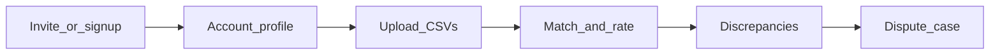

# Client setup (onboarding)

What a **warehouse / shipper client** does to use Shiprate Enforcer: account profile, data upload, finding overcharges, and disputing carriers. Dispute email is sent **from the platform** (your Resend domain); the client configures **where** carrier mail should go and **how much** automation they want.

Platform operators: configure Resend and fees first — [app-setup.md](./app-setup.md).

---

## Overview

---

## 1. Get an organization

**Path A — Client wizard (co-branded)**

1. Partner sends link: `/p/{partnerSlug}/onboarding` (optionally with org token).
2. Client completes organization name, carriers, and first uploads.
3. API: `PUT /api/v1/organizations/{org_id}/client-onboarding`

**Path B — Import center (dev / direct)**

1. Open [Import center](http://127.0.0.1:43123/imports).
2. Create org or paste **Organization ID** into the box (saved in browser as `shiprate_demo_org_id`).

The org id is required on every screen until full auth (Clerk) replaces the header.

---

## 2. Account profile (recommended first step)

URL: [http://127.0.0.1:43123/account](http://127.0.0.1:43123/account)

API: `GET/PATCH /api/v1/organizations/current/profile`

| Section | What to fill in |
|---------|------------------|
| **Company** | Legal name |
| **Contacts** | Primary, billing, disputes emails (for your team’s records) |
| **Carriers** | Comma list, e.g. `UPS, FedEx, USPS` |
| **Tolerances** | Absolute dollars and percent — when billed vs allowed is “close enough” |
| **Disputes — Autonomy** | How much the agent may send without a person (see below) |
| **Carrier billing emails** | Per carrier code, e.g. `UPS` → address disputes are emailed **to** |
| **People** | Optional roster (owner, admin, billing, viewer) |

**Read-only on this page:** platform **recovery fee %** (`recovery_fee_bps`) — set by the operator, not the client.

### Autonomy tiers (upsell)

| Tier | Client experience |
|------|-------------------|
| `draft` | Agent writes each message; a person clicks **Send to carrier** on each draft. |
| `approve_each` | Agent drafts; person clicks **Approve send** before mail goes out. |
| `autonomous` | Agent sends and counters until stop rules or platform pause (partial credit). |

Default: `draft`.

Carrier codes in billing emails should match shipment/invoice data (e.g. `UPS`, not `ups ground`).

---

## 3. Upload data

URL: [http://127.0.0.1:43123/imports](http://127.0.0.1:43123/imports)

1. Upload **shipment export** CSV.
2. Upload **carrier invoice** CSV.
3. Confirm column mapping (template or AI assist).
4. Run **matching** (+ compliance) — use the sample pipeline button for a demo, or API `POST /matching/run`.

Approved **rate card** must exist for the org or compliance will not create discrepancies.

---

## 4. Review discrepancies

URL: [http://127.0.0.1:43123/discrepancies](http://127.0.0.1:43123/discrepancies)

1. Click **Save & refresh** with the correct Organization ID.
2. Click the green **Billed** amount on a row to open detail.
3. Optionally set review status and comment; save review.

Dashboard KPIs: [http://127.0.0.1:43123/dashboard](http://127.0.0.1:43123/dashboard) (`GET /reporting/summary`).

---

## 5. Open and run a dispute

On **Discrepancy detail**:

1. **Load** (if needed).
2. Set **Autonomy** on this page or save it on **Account** — click **Save autonomy**.
3. **Open dispute case** — claim amount comes from variance; fee rate is copied from platform settings at open time.
4. **Run agent step** — creates the first outbound draft (and sends automatically only if tier is `autonomous`).
5. On the draft:
   - **Copy** — clipboard for manual use.
   - **Send to carrier** — sends via platform Resend when configured; otherwise logged only.

After send, status becomes `awaiting_carrier`.

Do **not** click **Run agent step** repeatedly while waiting for the carrier; that returns an error until a reply exists.

### If tier is `approve_each`

Use **Approve send** on the case when status is `awaiting_approval`.

### Stopping a case

**Stop** closes negotiation without crediting.

---

## 6. Carrier replies and credits

**Today (manual):** operator or integrator posts a carrier reply:

`POST /api/v1/dispute-cases/{case_id}/replies`  
Body example: `{"subject":"Re: claim","body":"We offer $5","offered_amount_minor":500}`

- Full credit on `autonomous` may auto-close as **credited**.
- Partial credit or denial → status **awaiting_platform** — operator enters recovered amount:

`POST /api/v1/dispute-cases/{case_id}/record-credit`  
`{"recovered_amount_minor": 500}`

Platform fee is computed from the snapshotted `fee_bps` on the case.

**Later:** inbound email from Resend wired to `/replies` automatically.

---

## 7. Client vs platform responsibilities

| Task | Client | Platform (you) |
|------|--------|----------------|
| Profile, carriers, billing emails, autonomy | Yes | — |
| Recovery fee % | View only | Set via recovery-fee API |
| Resend domain / API key | — | Yes ([app-setup.md](./app-setup.md)) |
| Record partial recovery / fee | — | Yes (`record-credit`) |
| Upload invoices & shipments | Yes | Can assist in POC |

---

## 8. Quick API reference (client-safe)

| Action | Method | Path |
|--------|--------|------|
| Profile | GET/PATCH | `/organizations/current/profile` |
| Autonomy only | PATCH | `/organizations/current` `{ "autonomy_tier": "..." }` |
| List discrepancies | GET | `/discrepancies` |
| Open case | POST | `/discrepancies/{id}/open-case` |
| Agent step | POST | `/dispute-cases/{id}/negotiate` |
| Send draft | POST | `/dispute-cases/{id}/approve-send` `{ "message_id": "..." }` |
| Mail configured? | GET | `/dispute-cases/outbound-mail` |

Header on all calls: `X-Organization-Id: <client-org-uuid>`.

---

## Related docs

- [App setup](./app-setup.md) — Resend, migrations, operator tools
- [Wizard field lists](./wizard-field-lists.md) — partner vs client wizard fields
- [Partner variable sheet](./partner-variable-sheet.md)
